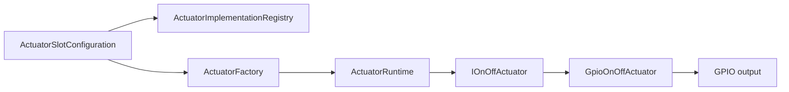
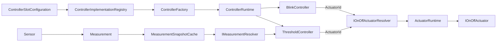

# Actuator and Controller Model

## Responsibility split

- Sensors observe physical reality and produce typed `Measurement`s.
- Controllers coordinate behavior over time.
- Actuators apply requested physical output through typed capabilities.
- Web and MQTT adapt external requests to the same internal interfaces.

Actuator state is runtime control state, not a Measurement. Controllers are not Sensors or Actuators.

## Configured Actuators

The implemented composition path is:

`ActuatorId` is the stable identity of a configured Slot. The registry describes reusable implementations and their capability and hardware requirements. `slot.hardware` is the single source of truth for the instance's `HardwareResourceAssignment`.

The current implementation is `gpio_on_off`. It requires a GPIO with `DigitalOutput` capability and exposes the `OnOff` domain capability through `IOnOffActuator`.

An adapter or Controller addresses an Actuator Slot and capability. It never addresses `GpioOnOffActuator` or GPIO directly.

## Capabilities

`OnOff` is currently the only implemented Actuator capability:

- `Off`
- `On`

Capability metadata lets clients request behavior without depending on its physical implementation. A future relay, remote output or other implementation may expose the same `OnOff` interface.

Level/percentage control remains future architecture. It is not currently implemented.

## Runtime ownership and rebuild

`ActuatorRuntime` owns the application-lifetime runtime composition and capability lookup by `ActuatorId`. `ActuatorFactory` uses fixed, aligned storage for deterministic construction.

A live rebuild stages a replacement composition, safely shuts down old Actuators, and activates the new composition without restarting the ESP32. Shutdown requests `Off` before releasing GPIO ownership where the implementation can do so.

Actuator state is independent of command source. Web, MQTT and Controllers all reach the same `IOnOffActuator`; `ActuatorStatePublisher` observes actual state and publishes it independently.

## Hardware validation

Actuators share EnvNode's hardware capability and occupancy infrastructure with Sensors:

- `BoardCapabilities` validates whether an assigned resource provides required capabilities.
- unified occupancy validation detects conflicts across enabled Sensor and Actuator slots
- exclusive GPIO reuse conflicts
- identical I2C bus/address claims conflict where applicable
- different addresses may share an I2C bus
- disabled slots do not claim hardware

Controllers do not own hardware assignments and do not participate in occupancy validation.

## Controllers and capability resolution

The implemented Controller composition and Measurement-driven path are:

Both Controllers retain an `ActuatorId`, not a concrete pointer. They resolve the current `IOnOffActuator` when needed. An Actuator runtime rebuild may therefore replace or move the physical implementation without leaving a stale pointer.

Blink contains timing and sequencing; the basic Actuator does not. Its cooperative monotonic state machine commands On and Off only at scheduled transitions. STOP cancels future transitions and requests Off.

Threshold consumes one copied Measurement snapshot identified by `MeasurementSourceReference` (`SensorId + MeasurementType`). It accepts `FloatingPoint` + `State` metadata, evaluates `onThreshold`/`offThreshold` hysteresis and uses `maxMeasurementAgeMs` against monotonic acceptance time. It retains neither a Sensor pointer nor cache storage. Missing, invalid or stale input produces no new decision and does not automatically force Off.

`ControllerRuntime` owns Controller instances and supports staged live replacement. Controller configuration changes request only `RestartControllerRuntime`; they do not inherently restart SensorRuntime or ActuatorRuntime.

## Controller target ownership

One configured enabled Controller may target an Actuator. A second enabled Blink or Threshold targeting the same `ActuatorId` is rejected across implementation types. Disabled Controllers do not claim a target, but runtime STOP does not release ownership because persistent `enabled` remains true. ConfigurationService is authoritative; Web filtering is convenience only.

## Contention

Controller-versus-Controller contention is prevented by exclusive enabled-Controller target ownership. Manual Web or MQTT Actuator commands remain deliberately last-command-wins relative to the owner. A manual change may remain until Blink's next scheduled transition or Threshold's next decision transition; Controllers do not continuously reconcile actual output state. No priority, lease or manual-versus-Controller arbitration model is implemented.
