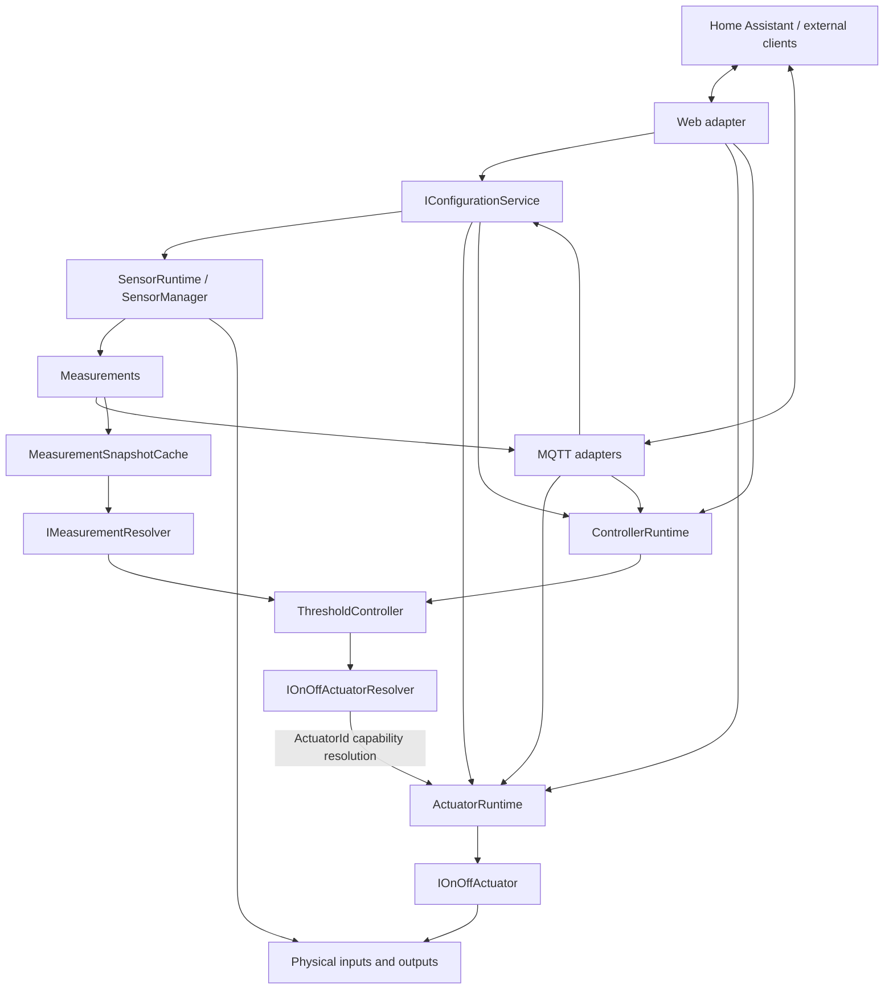

# System Architecture

## Purpose

EnvNode is an open-source embedded measurement platform designed for home automation systems.

Its primary purpose is to acquire reliable environmental measurements and make them available through standard interfaces.

The firmware intentionally focuses on measurement rather than interpretation.

---

# Architecture Overview

The firmware owns the hardware.

The automation platform owns weather analysis and higher-level automation. EnvNode may own explicit typed local control behavior such as Blink and Threshold/Hysteresis without becoming a weather-analysis engine.

Web and MQTT are external adapters over shared configuration and runtime interfaces. They do not define the internal Sensor, Actuator or Controller architecture.

Sensors observe and produce typed Measurements. Controllers consume runtime information and apply typed local behavior. Actuators expose physical-output capabilities. MQTT is an external representation and command adapter, never the internal Controller path.

---

# Responsibilities

The EnvNode firmware is responsible for:

- acquiring physical measurements
- converting sensor signals into physical units
- applying calibration
- monitoring sensor health
- managing hardware directly connected to the device
- exposing configuration
- providing diagnostics
- publishing measurements via MQTT
- supporting OTA firmware updates

The firmware is intentionally **not** responsible for:

- historical aggregation
- sunshine duration
- rainfall statistics
- weather forecasting
- evapotranspiration (ETo)
- irrigation logic
- long-term data storage
- automation workflows

These responsibilities belong to external software.

---

# Architectural Principles

## Measure first. Interpret later.

The firmware should publish reliable measurements.

Derived values belong to higher software layers.

---

## Separation of Concerns

Each subsystem has exactly one responsibility.

Examples:

- Configuration
- Connectivity
- Sensor acquisition
- Diagnostics
- Web interface
- OTA

Subsystems communicate through clearly defined interfaces.

---

## Hardware Independence

Application logic should depend on abstract sensor interfaces rather than concrete sensor implementations.

Replacing a sensor should require only a new driver.

Application logic should remain unchanged.

---

## Graceful Degradation

Failure of one subsystem must not stop the entire device.

Examples:

- MQTT unavailable → continue measurements
- Pressure sensor failed → publish remaining sensors
- Solar sensor unavailable → continue rain measurements
- NTP unavailable → continue measurements where possible

Whenever practical:

- continue operating
- isolate the failure
- expose diagnostics

---

## Simulation

The firmware shall support simulated sensors.

Simulation uses exactly the same interfaces as real hardware.

This allows development and testing without requiring the complete hardware platform.

---

## Configuration

Device configuration is persistent.

Configuration survives:

- reboot
- power loss
- firmware update

Installation-specific values should be configurable rather than hard-coded.

---

## Observability

The firmware should never behave as a black box.

Useful information should always be available through diagnostics.

Typical examples include:

- firmware version
- uptime
- restart reason
- WiFi RSSI
- MQTT state
- sensor availability
- sensor errors
- free memory

---

# System Boundary

The EnvNode firmware ends at the communication interface.

Everything beyond MQTT or the local web interface belongs to higher software layers.

This separation intentionally keeps the firmware:

- deterministic
- reusable
- maintainable
- testable

---

# Design Philosophy

Raw measurements are more valuable than interpreted values.

Interpretation evolves.

Measurements should not.

Whenever new functionality is proposed, the following question should be asked:

> Does this improve measurement quality?

If the answer is no, the functionality probably belongs outside the firmware.
