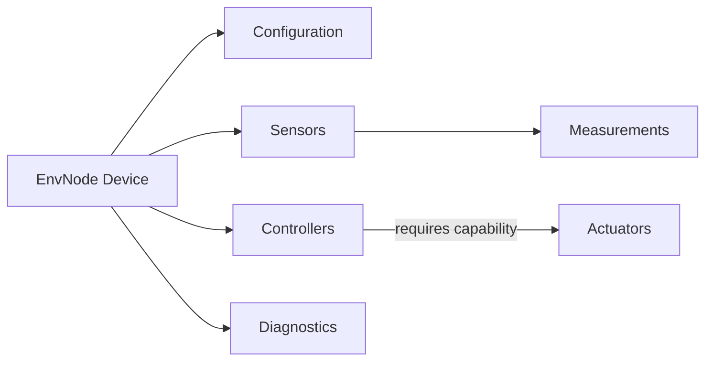

# Domain Model

## Purpose

This document defines the functional concepts of EnvNode. Technical realization through ESP32 hardware, NVS, HTTP and MQTT is described in [TechnicalArchitecture.md](TechnicalArchitecture.md).

EnvNode follows one principle:

> Measure first. Interpret later.

Sensors acquire observations. Controllers coordinate local behavior. Actuators apply physical output. These are separate domain responsibilities.

## Core concepts



The Device is the aggregate context for one installation. It owns one authoritative Configuration and the configured Sensor, Actuator and Controller slots. Web and MQTT are external adapters, not domain objects.

## Configuration, slots and implementations

Configuration contains persistent installation choices. Runtime state is not Configuration.

A **Slot** is a fixed, stable configured identity within one domain category:

- `SensorId` identifies a Sensor slot and Measurement source.
- `ActuatorId` identifies a configured Actuator instance.
- `ControllerId` identifies a configured Controller instance.

An **Implementation** describes reusable compiled behavior, such as SHT4x, `gpio_on_off`, or Blink. A Slot selects an Implementation and supplies its instance-specific configuration. Consequently, “Actuator Slot 1” is not synonymous with `GpioOnOffActuator` or GPIO16.

## Sensor

A Sensor is one physical or simulated acquisition source. It initializes and reads its source, converts hardware-native data into canonical physical values, and emits typed Measurement content.

One Sensor may produce multiple Measurement types. SHT4x, for example, produces Temperature and RelativeHumidity. Different Sensors may produce the same type while remaining distinct sources.

Allowed Sensor processing includes conversion, calibration, compensation, filtering and debounce required to obtain a meaningful physical observation. Sensors do not perform forecasting, historical aggregation, irrigation decisions or other interpretation.

Physical and simulated Sensors use the same `ISensor` boundary and Measurement pipeline.

## Measurement

A Measurement represents an observed physical value or event. Its identity is the combination of source `SensorId` and `MeasurementType`.

A completed Measurement includes, as applicable:

- source Sensor identity
- Measurement type
- canonical value or event
- timestamp
- validity and quality
- provenance

Numeric Measurements use the canonical representation defined by their `MeasurementType`. Presentation units are external representation choices and never alter acquisition or physical meaning. Actuator state is not a Measurement merely because it can be observed externally.

## Actuator

An Actuator applies requested physical output. It does not acquire Measurements, decide when it should operate, or know which external adapter issued a command.

Four concepts remain distinct:

| Concept | Current example |
|---|---|
| Domain capability | `OnOff` |
| Reusable implementation | `gpio_on_off` / `GpioOnOffActuator` |
| Configured instance | Actuator Slot N, identified by `ActuatorId` |
| Physical resource | `HardwareResourceAssignment` to a GPIO |

The currently implemented capability is `OnOff`, represented by `IOnOffActuator` and the states `On` and `Off`. A caller requiring this behavior depends on the capability, not on GPIO, `GpioOnOffActuator`, or a hardware assignment. Future hardware or protocol implementations may expose the same capability.

Level/percentage control is an established future direction, not an implemented capability.

## Controller

A Controller coordinates behavior over time and controls Actuators through required capabilities. It is neither a Sensor nor an Actuator.

A configured Controller has a stable `ControllerId`, selected implementation, implementation-specific configuration and domain dependencies such as a target `ActuatorId`. Controllers do not own physical hardware assignments.

Persistent Controller configuration and runtime state are deliberately separate:

| Persistent configuration | Runtime state |
|---|---|
| enabled | running/stopped |
| implementation | current phase |
| target `ActuatorId` | target available/unavailable |
| implementation parameters | last operation result |

START and STOP are transient runtime operations. They do not rewrite persistent `enabled`. An enabled Controller may therefore be manually stopped and started again without a configuration rebuild.

## BlinkController

Blink is the first Controller implementation and an architectural proof, not the final purpose of the Controller model. Its typed configuration contains target `ActuatorId`, On duration and Off duration. Blink requires the target implementation to advertise `OnOff`.

It uses a monotonic clock and cooperative, non-blocking servicing:

```text
START -> resolve target -> On -> wait On duration
      -> Off -> wait Off duration -> repeat

STOP  -> stop transitions -> request target Off where available
```

Blink does not depend on GPIO, `GpioOnOffActuator`, MQTT, Web, wall-clock time or NTP.

## Capability resolution and runtime replacement

Controllers retain `ActuatorId`, not a long-lived pointer to a concrete Actuator. Each operation resolves the current capability through:

```text
IOnOffActuatorResolver
    -> ActuatorRuntime
    -> current IOnOffActuator for ActuatorId
```

If Actuator Slot 1 is rebuilt from GPIO16 to GPIO17, a Controller still targets ActuatorId 1 and resolves the replacement runtime instance. This is deliberate domain decoupling and stale-pointer/lifetime protection.

Configuration-time compatibility and runtime availability are different. Validation ensures an enabled Controller references a valid enabled Actuator implementation advertising its required capability. Initialization may still fail or the runtime capability may be temporarily unavailable. Blink waits cooperatively and can recover when resolution succeeds again.

## Hardware ownership

Configured Sensors and Actuators may own `HardwareResourceAssignment`s. Controllers never do.

Board capability validation answers whether a resource can support an implementation. Unified occupancy validation answers whether enabled Sensor and Actuator slots may use their assignments together:

- identical exclusive GPIO assignments conflict
- Sensor/Actuator and Actuator/Actuator GPIO collisions conflict
- identical I2C bus/address claims conflict where applicable
- different addresses may share one I2C bus
- disabled slots do not actively claim hardware

Web filtering is only a convenience. Configuration validation remains authoritative.

## External adapters and contention

Web and MQTT translate external requests into the same configuration, runtime and capability interfaces. They do not manipulate GPIO or concrete Controller/Actuator implementations.

If Web, MQTT and a running Controller command the same Actuator, current behavior is last-command-wins. Blink commands only at scheduled transitions, so a manual change may remain until the next transition. No ownership, priority, locking or arbitration model currently exists.

## Future Measurement-driven Controllers

Future Controllers may consume specific Measurement sources. Such an input should identify the Measurement by `SensorId + MeasurementType`, not merely by Sensor. Threshold or hysteresis control is a possible future implementation, not current behavior.

## Current status

### Implemented and verified

- fixed Sensor slots, implementation registry, factory/runtime composition and scheduling
- typed Measurement pipeline, snapshots and MQTT publication
- fixed Actuator slots and stable `ActuatorId`
- Actuator implementation registry and capability metadata
- `OnOff`, `IOnOffActuator` and `GpioOnOffActuator`
- unified Sensor/Actuator hardware occupancy validation
- deterministic Actuator construction, safe shutdown and live rebuild
- Web and MQTT Actuator control with command-source-independent state publication
- fixed Controller slots and stable `ControllerId`
- Controller implementation registry, factory and runtime
- BlinkController with cooperative non-blocking service
- live Controller rebuild and transient runtime START/STOP
- Web Controller configuration and control
- MQTT Controller status, START/STOP, retained Blink parameter state and persistent parameter commands
- capability resolution across Actuator runtime replacement

### Deliberately future or not implemented

- Level/percentage and other Actuator capabilities
- additional Controller implementations
- Measurement-driven and threshold/hysteresis Controllers
- generic external Actuator or Controller self-description
- generic Controller parameter-description schema
- Controller Home Assistant discovery
- generic Actuator Home Assistant discovery
- command-source arbitration or ownership
- scripting/rule engine and generic command/event bus
