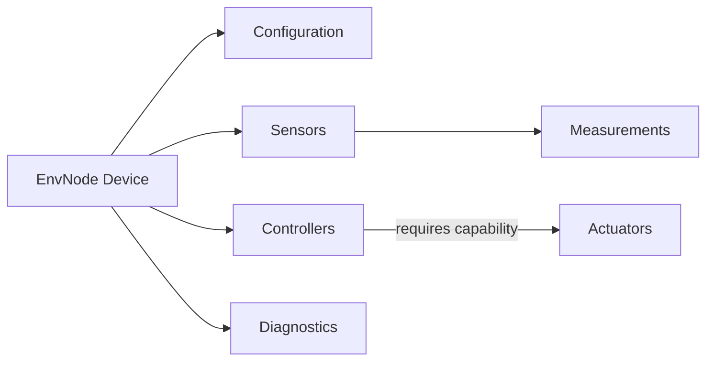

# Domain Model

## Purpose

This document defines the functional concepts of EnvNode. Technical realization through ESP32 hardware, NVS, HTTP and MQTT is described in [TechnicalArchitecture.md](TechnicalArchitecture.md).

EnvNode follows one principle:

> Measure first. Interpret later.

Sensors acquire observations. Controllers coordinate local behavior. Actuators apply physical output. These are separate domain responsibilities.

## Core concepts



The Device is the aggregate context for one installation. It owns one authoritative Configuration and the configured Sensor, Actuator and Controller slots. Web and MQTT are external adapters, not domain objects.

## Configuration, slots and implementations

Configuration contains persistent installation choices. Runtime state is not Configuration.

A **Slot** is a fixed, stable configured identity within one domain category:

- `SensorId` identifies a Sensor slot and Measurement source.
- `ActuatorId` identifies a configured Actuator instance.
- `ControllerId` identifies a configured Controller instance.

An **Implementation** describes reusable compiled behavior, such as SHT4x, `gpio_on_off`, or Blink. A Slot selects an Implementation and supplies its instance-specific configuration. Consequently, “Actuator Slot 1” is not synonymous with `GpioOnOffActuator` or GPIO16.

## Sensor

A Sensor is one physical or simulated acquisition source. It initializes and reads its source, converts hardware-native data into canonical physical values, and emits typed Measurement content.

One Sensor may produce multiple Measurement types. SHT4x, for example, produces Temperature and RelativeHumidity. Different Sensors may produce the same type while remaining distinct sources.

Allowed Sensor processing includes conversion, calibration, compensation, filtering and debounce required to obtain a meaningful physical observation. Sensors do not perform forecasting, historical aggregation, irrigation decisions or other interpretation.

Physical and simulated Sensors use the same `ISensor` boundary and Measurement pipeline.

## Measurement

A Measurement represents an observed physical value or event. Its identity is the combination of source `SensorId` and `MeasurementType`.

A completed Measurement includes, as applicable:

- source Sensor identity
- Measurement type
- canonical value or event
- timestamp
- validity and quality
- provenance

Numeric Measurements use the canonical representation defined by their `MeasurementType`. Presentation units are external representation choices and never alter acquisition or physical meaning. Actuator state is not a Measurement merely because it can be observed externally.

The read-only [local property view](LocalProperties.md) exposes Sensor state Measurements, logical On/Off Actuator output and Threshold Controller evaluation reasons through stable references. Sensor properties reuse the existing metadata and snapshot resolver; Actuator properties read the existing output capability.

The shared `PropertyResolver` routes local references to the current Sensor, Actuator or Controller property reader. It stores no component bindings or duplicate values and resolves against the current runtime on each call. The Measurements page includes a one-source text preview using this resolver and a bounded, typed formatter. Preview parameters are URL inputs, not persistent display configuration.

## Actuator

An Actuator applies requested physical output. It does not acquire Measurements, decide when it should operate, or know which external adapter issued a command.

Four concepts remain distinct:

| Concept | Current example |
|---|---|
| Domain capability | `OnOff`, `Level` |
| Reusable implementation | `gpio_on_off` / `GpioOnOffActuator`, `gpio_pwm` / `GpioPwmActuator` |
| Configured instance | Actuator Slot N, identified by `ActuatorId` |
| Physical resource | `HardwareResourceAssignment` to a GPIO |

`OnOff` is represented by `IOnOffActuator`. `Level` is a validated normalized 0–100 percentage
represented by `ILevelActuator`; it is independent of PWM. Level centrally satisfies OnOff,
mapping Off to 0 and On to 100 without previous-Level restoration. A caller depends on the
capability, not on GPIO, PWM, a concrete Actuator, or a hardware assignment.

## Controller

A Controller coordinates behavior over time and controls Actuators through required capabilities. It is neither a Sensor nor an Actuator.

A configured Controller has a stable `ControllerId`, selected implementation, implementation-specific configuration and domain dependencies such as a target `ActuatorId`. Controllers do not own physical hardware assignments.

Persistent Controller configuration and runtime state are deliberately separate:

| Persistent configuration | Runtime state |
|---|---|
| enabled | running/stopped |
| implementation | current phase or decision |
| target `ActuatorId` | target available/unavailable |
| implementation parameters | last operation result |

START and STOP are transient runtime operations. They do not rewrite persistent `enabled`. An enabled Controller may therefore be manually stopped and started again without a configuration rebuild. Blink START begins a fresh Blink cycle. Threshold START resets decision to Unknown and immediately evaluates a currently usable snapshot when one exists. STOP halts behavior and requests target Off where possible.

## BlinkController

Blink is the first Controller implementation and an architectural proof, not the final purpose of the Controller model. Its typed configuration contains target `ActuatorId`, On duration and Off duration. Blink requires the target implementation to advertise `OnOff`.

It uses a monotonic clock and cooperative, non-blocking servicing:

```text
START -> resolve target -> On -> wait On duration
      -> Off -> wait Off duration -> repeat

STOP  -> stop transitions -> request target Off where available
```

Blink does not depend on GPIO, `GpioOnOffActuator`, MQTT, Web, wall-clock time or NTP.

## MeasurementSourceReference and ThresholdController

A Controller input identifies a specific Measurement stream with `MeasurementSourceReference`:

- `SensorId`
- `MeasurementType`

This is more precise than identifying only a Sensor because one Sensor implementation may advertise several Measurement types. Sensor names, implementations, GPIO assignments, MQTT topics and runtime Sensor pointers are not part of Measurement identity.

Threshold is the implemented Measurement-driven Controller. Its typed configuration contains one `MeasurementSourceReference`, target `ActuatorId`, `onThreshold`, `offThreshold` and `maxMeasurementAgeMs`. It accepts only Measurement metadata classified as `FloatingPoint` and `State`; Boolean state, event and numeric event/delta Measurements are excluded.

Its hysteresis decision is:

```text
value >= onThreshold               -> On
value <= offThreshold              -> Off
offThreshold < value < onThreshold -> retain previous decision
```

The initial decision is `Unknown`. A first usable in-band Measurement leaves it Unknown and issues no Actuator command. Missing, invalid or stale input creates no new decision and does not force Off. The previous decision remains diagnostically visible. Explicit STOP is different: it stops evaluation, resets the decision lifecycle and requests target Off where possible.

Threshold freshness uses monotonic elapsed time from the snapshot's `acceptedMonotonicMs`, not NTP, timezone, wall-clock Measurement timestamp or Sensor schedule. `MeasurementQuality` remains visible but Good, Estimated and Degraded are all accepted when the Measurement is otherwise valid, compatible and fresh; no generic Controller quality policy exists.

`MeasurementSnapshotCache` stores bounded latest snapshots indexed by `SensorId + MeasurementType`. Each snapshot includes monotonic acceptance time and a revision identifying accepted changes. `IMeasurementResolver` returns copied snapshots through a narrow read-only interface, so Controllers do not depend on cache internals or retain Sensor pointers. It is neither a history buffer nor an event bus.

A SensorRuntime rebuild clears SensorManager and the snapshot cache. Controllers then cannot evaluate the old composition's snapshots; a replacement Sensor must emit a new Measurement. ControllerRuntime need not be rebuilt merely because the implementation behind the same `SensorId` is replaced while the referenced Measurement remains compatible.

## Capability resolution and runtime replacement

Controllers retain `ActuatorId`, not a long-lived pointer to a concrete Actuator. Each operation resolves the current capability through:

```text
IOnOffActuatorResolver
    -> ActuatorRuntime
    -> current IOnOffActuator for ActuatorId
```

If Actuator Slot 1 is rebuilt from GPIO16 to GPIO17, a Controller still targets ActuatorId 1 and resolves the replacement runtime instance. This is deliberate domain decoupling and stale-pointer/lifetime protection.

Configuration-time compatibility and runtime availability are different. Validation ensures an enabled Controller references a valid enabled Actuator implementation advertising its required capability. Initialization may still fail or the runtime capability may be temporarily unavailable.

Measurement-driven Controllers likewise retain `SensorId + MeasurementType`, not Sensor pointers, and resolve copied snapshots through `IMeasurementResolver`. SensorRuntime, ActuatorRuntime and ControllerRuntime can therefore be rebuilt independently when stable identities and capabilities remain compatible.

## Configuration integrity

ConfigurationService validates the complete candidate composition before persistence. An enabled Threshold Controller requires an enabled source Sensor whose selected implementation advertises the referenced Threshold-compatible Measurement, plus an enabled target Actuator advertising `OnOff`. Enabled Blink requires an enabled `OnOff` target. Reverse integrity rejects changing a referenced Sensor to an incompatible source or disabling/removing/making a referenced Actuator capability-incompatible. Duplicate targets across enabled Controllers are rejected regardless of Controller implementation. Web and MQTT filtering never replace these authoritative checks.

## Hardware ownership

Configured Sensors and Actuators may own `HardwareResourceAssignment`s. Controllers never do.

Board capability validation answers whether a resource can support an implementation. Unified occupancy validation answers whether enabled Sensor and Actuator slots may use their assignments together:

- identical exclusive GPIO assignments conflict
- Sensor/Actuator and Actuator/Actuator GPIO collisions conflict
- identical I2C bus/address claims conflict where applicable
- different addresses may share one I2C bus
- disabled slots do not actively claim hardware

Web filtering is only a convenience. Configuration validation remains authoritative.

## External adapters and contention

Web and MQTT translate external requests into the same configuration, runtime and capability interfaces. They do not manipulate GPIO or concrete Controller/Actuator implementations.

Only one configured enabled Controller may target a given Actuator. A disabled Controller does not claim its configured target, but transient runtime STOP does not release ownership: the Controller remains configured enabled. This prevents Controller-versus-Controller contention without runtime locks or arbitration.

Manual Web and MQTT Actuator commands remain allowed while a Controller owns the target. Current behavior is last-command-wins. Controllers do not continuously reconcile actual Actuator state with an internal phase or decision. For example, after Threshold commands On, a user may command Off; Threshold does not immediately reassert On every loop, but a later decision transition may command again. No priority, lease or manual-versus-Controller arbitration model exists.

## Future multi-input Controllers

Future typed implementations may contain multiple `MeasurementSourceReference` values when a real behavior requires them. A future RainDetectorController might combine rain/wet or detector-level input with outside and detector-surface temperatures. EnvNode intentionally does not introduce Boolean-expression syntax, scripting or a generic rule engine. Generalization should follow multiple demonstrated use cases.

## Current status

### Implemented and verified

Controller infrastructure v1 is implemented, tested and physically verified for the current Blink and Threshold/Hysteresis feature set. This establishes the runtime, configuration and adapter boundaries without claiming that all future Controller needs are solved.

- fixed Sensor slots, implementation registry, factory/runtime composition and scheduling
- typed Measurement pipeline, snapshots and MQTT publication
- fixed Actuator slots and stable `ActuatorId`
- Actuator implementation registry and capability metadata
- `OnOff`, `IOnOffActuator` and `GpioOnOffActuator`
- unified Sensor/Actuator hardware occupancy validation
- deterministic Actuator construction, safe shutdown and live rebuild
- Web and MQTT Actuator control with command-source-independent state publication
- fixed Controller slots and stable `ControllerId`
- Controller implementation registry, factory and runtime
- BlinkController with cooperative non-blocking service
- ThresholdController with MeasurementSourceReference, hysteresis and monotonic freshness
- bounded MeasurementSnapshotCache and read-only IMeasurementResolver
- live Controller rebuild and transient runtime START/STOP
- exclusive enabled-Controller target ownership
- Web Controller configuration, compatible source/target filtering, diagnostics and control
- MQTT Controller status, START/STOP, retained Blink/Threshold parameter state and persistent parameter commands
- capability resolution across Actuator runtime replacement
- physically verified Sensor -> Measurement -> Controller -> Actuator behavior

### Deliberately future or not implemented

- additional Actuator capabilities beyond OnOff and Level
- additional Controller implementations
- multi-input, Boolean/contact and event-driven Controller semantics
- RainDetector-specific control behavior
- atomic external mutation of structural Measurement source configuration
- generic Controller parameter-description schema
- Controller Home Assistant discovery
- generic Actuator Home Assistant discovery
- richer manual-versus-Controller arbitration
- scripting/rule engine and generic command/event bus
