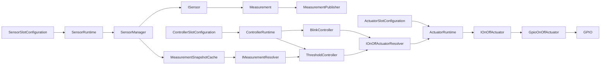

# Technical Architecture

## Purpose

This document defines the technical architecture of EnvNode.

It describes how the EnvNode domain model is realized on the embedded platform and how the different technical layers interact.

The domain model itself is defined separately in `DomainModel.md`.

This document intentionally focuses on technical responsibilities such as:

- runtime
- hardware abstraction
- connectivity
- communication
- persistence
- time synchronization
- configuration
- web access
- firmware updates
- diagnostics

The goal is to keep the technical architecture modular, maintainable and largely independent from individual sensor implementations.

Hardware may evolve over time without requiring architectural changes to higher software layers.

The EnvNode firmware intentionally limits itself to acquiring and publishing measurements.

Interpretation of weather data belongs to external systems such as Home Assistant or other automation platforms.

Examples include:

- daily rainfall
- sunshine duration
- evapotranspiration
- historical statistics
- weather interpretation

The fundamental architectural principle therefore remains:

> Measure, don't interpret.

---

# Architectural Layers

EnvNode is divided into four technical layers:

1. Application Layer
2. Communication Layer
3. Connectivity and Infrastructure Layer
4. Hardware Layer

Conceptually:

    +--------------------------------------------------+
    |                Application Layer                 |
    |--------------------------------------------------|
    | Device orchestration                             |
    | Sensor coordination                              |
    | Measurement coordination                         |
    | Configuration usage                              |
    | Diagnostics                                      |
    | Local hardware control                           |
    +-------------------------+------------------------+
                              |
                              v
    +--------------------------------------------------+
    |              Communication Layer                 |
    |--------------------------------------------------|
    | MQTT                                             |
    | HTTP / Web Interface                             |
    | OTA                                              |
    +-------------------------+------------------------+
                              |
                              v
    +--------------------------------------------------+
    |       Connectivity and Infrastructure Layer      |
    |--------------------------------------------------|
    | Configuration                                    |
    | WiFi                                             |
    | Time / NTP                                       |
    | Logging                                          |
    | Persistent Storage                               |
    +-------------------------+------------------------+
                              |
                              v
    +--------------------------------------------------+
    |                  Hardware Layer                  |
    |--------------------------------------------------|
    | GPIO                                             |
    | I2C                                              |
    | ADC                                              |
    | OneWire                                          |
    | PWM                                              |
    | ESP32 hardware                                   |
    +--------------------------------------------------+

Dependencies always point downward.

Higher layers may depend on lower layers.

Lower layers must never depend on application-specific logic.

Each layer owns one clearly defined technical responsibility.

Communication protocols use infrastructure.

Application logic uses services.

Services use hardware abstractions.

Hardware remains unaware of application behaviour.

---

# Application Layer

The Application Layer coordinates the EnvNode as a whole.

It connects the domain model to the technical infrastructure services.

Typical responsibilities include:

- initializing the device
- loading configuration
- initializing infrastructure services
- coordinating sensors
- coordinating actuators
- coordinating Measurements
- exposing diagnostics
- coordinating communication services
- managing lifecycle state

The Application Layer intentionally contains very little implementation logic.

Its primary responsibility is orchestration.

Concrete implementations remain inside dedicated services.

Examples include:

- ConfigurationService
- WiFiService
- TimeService
- MqttService
- WebService

Future examples include:

- SensorManager
- MeasurementPublisher

Compiled Sensor capabilities are described by `SensorImplementationRegistry`. Persistent
`SensorSlotConfiguration` objects define the desired runtime composition, including stable
Slot identity, enablement, name, implementation, schedule and typed hardware assignment.
`ConfigurationService` owns their defaults, validation and NVS persistence.

At boot, `SensorFactory` constructs enabled, non-None runtime Sensors from the validated
Slot configuration using statically bounded placement storage. Disabled and None Slots
remain configurable but create no runtime Sensor. `BoardCapabilities` validates approved
GPIO resources, and enabled physical GPIO Slots may not share one exclusive GPIO.

The active typed `BoardProfile` is the single immutable description of physical board
resources. `BoardCapabilities` derives its lookup and compatibility validation from that
profile; it does not own a second pin map. The profile is selected once during boot by the
`BoardIdentityResolver` and remains frozen for that boot. A valid, supported EEPROM identity
selects the matching profile. If the identity record is absent, unreadable, blank, malformed,
or fails its integrity check, an explicitly configured build-time development fallback may
be used. A valid but unsupported identity does not fall back and prevents normal runtime
operation. Firmware Build Identity and physical Board Identity remain separate models.

The current `EnvNode Mainboard` profile is hardware revision 0.3. It exposes I2C0 on
SDA GPIO21 / SCL GPIO22 and I2C1 on SDA GPIO25 / SCL GPIO26. Generic digital resources are
GPIO4, GPIO13, GPIO14, GPIO15, GPIO16, GPIO17, GPIO18, GPIO19, GPIO23, GPIO32 and GPIO33.
GPIO32 and GPIO33 additionally support analog input; GPIO34, GPIO35, GPIO36 and GPIO39 are
analog-input-only EnvNode resources. I²C pins are described only by the bus definitions and
are therefore never offered as generic GPIO resources.

Future EnvNode 868 and EnvNode Nano builds can provide different immutable profiles without
changing hardware consumers, regardless of whether a profile originates from EEPROM identity
or the explicit development fallback. Module identification scans the two reserved `I2C0`
addresses independently. A registry resolves valid identity records to declarative module
profiles, and compatibility validation compares their connector-resource requirements with
the selected board profile's slot mapping. This stage is diagnostic only: driver creation,
live profile replacement, and SPI module definitions remain outside the current architecture.

`I2CBusManager` owns initialization and access to the physical `TwoWire` instances described
by the active profile. Its diagnostic scan probes only normal usable 7-bit addresses
for acknowledgement on already-initialized buses. Startup scans all board buses once after
bus initialization and module discovery, before sensor runtime starts. Scan failures are
reported without stopping startup. The manager caches the latest result per bus in RAM.
The Web Diagnostics page displays these results and SDA/SCL metadata from `BoardProfile`;
opening or reloading the page does not initiate another scan. A manual scan refreshes all
board buses. Known EEPROM addresses are annotated using the resolved board identity and
module discovery results. The cache is non-persistent and scanning does not rebuild or
pause Sensor runtime composition. Sensor servicing and
Web request handling are serialized by the cooperative application loop, so their I²C
transactions cannot overlap in the current execution model.

Sensor administration is available through the Web Sensors page. A successful edit stores
the desired Slot configuration and requests `RestartSensorManager`; it does not activate the
change automatically. The explicit **Apply Sensor Changes** action asks RuntimeManager to
rebuild the complete composition while WiFi, MQTT, time and Web services remain active.

SensorRuntime stages the desired composition in a second statically bounded SensorFactory.
After successful construction it clears SensorManager, registers and begins the new Sensors,
then destroys the previous instances. If registration fails, the still-alive previous
composition is restored. RuntimeManager clears `RestartSensorManager` only after a successful
rebuild and never downgrades a stronger pending action. The Device is not rebooted.

The Application Layer must not contain:

- hardware driver logic
- MQTT protocol implementation
- HTTP implementation
- NTP implementation
- persistent storage implementation
- ESP32-specific API calls

Application logic therefore remains largely independent from hardware details and communication protocols.

This separation keeps the firmware modular while allowing infrastructure components to evolve independently.

## Domain runtime compositions

EnvNode deliberately has three separate runtime models. They share slot, registry, factory and lifecycle patterns, but not domain behavior.



### Sensor runtime

`SensorImplementationRegistry` describes compiled Sensor implementations, supported Measurements, scheduling defaults and hardware requirements. Persistent fixed `SensorSlotConfiguration`s select reusable implementations, names, schedules and hardware assignments.

`SensorFactory` constructs enabled instances. `SensorRuntime` manages composition replacement, while `SensorManager` owns acquisition scheduling, Measurement acceptance and delivery to `MeasurementSnapshotCache` and `MeasurementPublisher`. Sensor configuration can be applied through the implemented Sensor rebuild path without restarting the ESP32.

### Actuator runtime

`ActuatorImplementationRegistry` describes reusable implementations, capabilities and required hardware capabilities. Persistent fixed `ActuatorSlotConfiguration`s provide stable `ActuatorId`, enablement, name, implementation and the sole hardware assignment.

`ActuatorFactory` constructs deterministic in-place instances. `ActuatorRuntime` owns their
lifecycle and exposes capability lookup by `ActuatorId`. `gpio_on_off` exposes
`IOnOffActuator`; `gpio_pwm` exposes `ILevelActuator` and implements normalized 0–100 Level
using ESP32 LEDC. Level centrally satisfies OnOff with Off=0 and On=100. Callers never
manipulate GPIO, LEDC channels or PWM duty directly.

Live rebuild stages a new composition, safely shuts down the previous outputs Off where possible, and replaces the active instances without a Device restart.

### Controller runtime

`ControllerImplementationRegistry` describes reusable Controller implementations and required Actuator capabilities. Fixed `ControllerSlotConfiguration`s provide stable `ControllerId`, enablement, name, implementation and typed implementation configuration.

`ControllerFactory` constructs `IController` instances. `ControllerRuntime` owns composition, cooperative servicing, diagnostics and transient Start/Stop operations. Enabled Controllers start automatically when a composition is initialized or rebuilt; manually stopped state is not persisted across rebuild.

Blink uses `ActuatorId` and `IOnOffActuatorResolver` to obtain the current capability from `ActuatorRuntime`. It never retains a concrete Actuator pointer across an Actuator rebuild. It uses monotonic, non-blocking timing and has no Web, MQTT, GPIO, wall-clock or NTP dependency.

Threshold identifies exactly one input stream with `MeasurementSourceReference` (`SensorId + MeasurementType`). It obtains copied `MeasurementSnapshot`s from `IMeasurementResolver` and retains no Sensor or cache pointer. Its compatible inputs are metadata-classified `FloatingPoint` + `State` Measurements. `acceptedMonotonicMs` supplies freshness and `revision` supplies accepted-change identity; wall-clock Measurement timestamp remains diagnostic/external time.

Threshold begins with decision `Unknown`. Values at or above `onThreshold` decide On, values at or below `offThreshold` decide Off, and in-band values retain the previous decision. First input in-band remains Unknown. Missing, invalid or stale input makes no new decision and does not force Off. Good, Estimated and Degraded quality labels do not independently reject otherwise usable input.

Controller validation checks configured references, enablement and advertised types/capabilities. An enabled Threshold source Sensor must advertise the selected compatible Measurement; Blink and Threshold targets must advertise `OnOff`. Reverse validation prevents referenced Sensors or Actuators becoming incompatible. One configured enabled Controller may claim each target across all implementations. Runtime STOP does not release this configured ownership. Runtime availability remains separate and may temporarily fail despite valid configuration.

### Hardware occupancy

Sensors and Actuators share one authoritative hardware occupancy validation pass across enabled slots. Board capability validation remains a separate concern.

- exclusive GPIO collisions are rejected across Sensor/Sensor, Sensor/Actuator and Actuator/Actuator assignments
- identical I2C bus/address claims conflict where applicable
- different addresses may share an I2C bus
- disabled slots do not claim hardware
- Controllers own no `HardwareResourceAssignment`

Web option filtering assists the user but does not replace ConfigurationService validation.

### Runtime apply effects

Configuration changes request the narrowest implemented lifecycle action:

```text
Sensor change     -> RestartSensorManager     -> Sensor runtime rebuild
Actuator change   -> RestartActuatorRuntime   -> ActuatorRuntime rebuild
Controller change -> RestartControllerRuntime -> ControllerRuntime rebuild
```

These apply paths keep WiFi, MQTT, Web and unrelated domain runtimes operating. They do not promise a generic hot-swap mechanism for arbitrary subsystems.

---

# Communication Layer

The Communication Layer exposes EnvNode functionality to external systems.

Communication protocols remain independent from the transport mechanisms underneath them.

The initial communication mechanisms are:

- MQTT
- HTTP
- OTA

Communication components never own configuration or measurements.

Instead, they consume domain objects and infrastructure services.

The Communication Layer therefore remains responsible for representation and transport rather than business logic.

---

## MQTT

MQTT is the primary integration protocol.

MQTT operates on top of network connectivity provided by the Connectivity Layer.

Conceptually:

    Canonical Measurement
        |
        v
    MeasurementPublisher
        |
        | presentation conversion
        | serialization
        v
    MQTT representation
        |
        v
    MqttService
        |
        v
    WiFi
        |
        v
    Network

MQTT is responsible for:

- publishing Measurements
- publishing device state
- publishing diagnostics
- publishing availability
- receiving explicitly supported configuration commands

MQTT is not responsible for:

- acquiring Measurements
- interpreting weather data
- converting hardware representations
- converting physical units
- maintaining WiFi connectivity
- synchronizing system time
- storing persistent configuration
- storing long-term data

MqttService owns broker connectivity and transport only.

Inbound protocol adapters share the single MqttService callback through `MqttMessageRouter`. The router only multiplexes transport messages; it is not a domain command bus or event bus.

Translation of domain Measurements into MQTT topics and payloads belongs to MeasurementPublisher.

The initial MeasurementPublisher publishes every accepted Measurement without buffering, suppression or aggregation.

### Measurement Snapshot Diagnostics

`MeasurementSnapshotCache` is a passive observer at SensorManager's accepted-Measurement
boundary. It uses fixed bounded storage and retains only the latest completed canonical
Measurement, monotonic acceptance time and revision for each SensorId and MeasurementType.
`IMeasurementResolver` is the narrow read-only Controller-facing boundary and returns copied
snapshots. Web diagnostics also receive read-only access and apply Presentation Unit conversion
only while rendering.

The cache does not publish MQTT, own Sensor runtime, aggregate values, persist data or
influence Measurement acceptance and delivery. It is not history storage or an event bus. It
is cleared with the active Sensor runtime composition, so Controllers cannot continue using
pre-rebuild snapshots and a replacement Sensor must emit a new Measurement. A ControllerRuntime
rebuild is not inherently required when the same SensorId continues providing the referenced
MeasurementType. MeasurementPublisher remains the authoritative Measurement publisher and the
only downstream publishing sink.

Topics use:

    envnode/<deviceName>/sensor/<sensorId>/<measurementType>

with deterministic topic-safe device-name normalization, decimal SensorId serialization and stable lowercase MeasurementType names. Sensor names and implementation types are metadata and never form part of the external address.

Payloads use JSON with the Measurement timestamp formatted from its assigned epoch as local ISO-8601 including the UTC offset.

MeasurementPublisher is responsible for making the externally presented unit of every numeric Measurement unambiguous.

According to ADR-0005, canonical domain values may be converted into the configured Presentation Unit before serialization.

Examples include:

    canonical Temperature in °C
            |
            v
    configured Presentation Unit
            |
            +----> °C
            +----> °F

and:

    canonical AtmosphericPressure in Pa
            |
            v
    configured Presentation Unit
            |
            +----> Pa
            +----> hPa
            +----> kPa
            +----> inHg

Unit conversion changes representation only.

It never changes the physical meaning, timestamp, validity, quality, source or provenance of a Measurement.

Boolean Measurements and value-free event Measurements do not acquire artificial units.

Invalid Measurements never fabricate a value.

This separation intentionally decouples:

- measurement acquisition
- canonical domain representation
- presentation
- transport

Loss of MQTT connectivity must never stop:

- sensor acquisition
- local hardware control
- web administration
- diagnostics

MQTT shall continue reconnecting in the background while WiFi connectivity is available.

MQTT connectivity may become available before valid system time exists.

However, publication of timestamped Measurements should only begin after TimeService reports successful synchronization.

### Actuator and Controller MQTT adapters

Actuator runtime commands resolve `ActuatorId` through `ActuatorRuntime` and use `IOnOffActuator`. `ActuatorStatePublisher` observes actual state independently of whether the latest command came from Web, MQTT or a Controller.

Controller MQTT topics use the normalized root and Device name:

```text
envnode/<device>/controller/<slot>/status
envnode/<device>/controller/<slot>/cmd
envnode/<device>/controller/<slot>/parameter/<parameter>
envnode/<device>/controller/<slot>/cmd/parameter/<parameter>
```

Their semantics are deliberately distinct:

- `status` is retained implementation-specific runtime truth.
- `cmd` accepts transient `START` or `STOP`; these do not change persistent `enabled`.
- `parameter/<parameter>` is authoritative retained persisted parameter state published by EnvNode.
- `cmd/parameter/<parameter>` is an external request to mutate persistent configuration.

Blink status fields are `running`, `phase`, `target_available` and `last_result`. Threshold status fields are `running`, `source_available`, `measurement_valid`, `stale`, `decision`, `target_available`, `output_pending` and `last_result`. Threshold decision strings are `unknown`, `on` and `off`. Latest Measurement value is intentionally not duplicated; Sensor MQTT remains authoritative Measurement telemetry.

Blink parameters are `on_duration_ms` and `off_duration_ms`. Threshold parameters are `on_threshold`, `off_threshold` and `max_measurement_age_ms`. Parameter commands follow:

```text
MQTT cmd/parameter
 -> ControllerMqttAdapter
 -> candidate ControllerSlotConfiguration
 -> IConfigurationService validation and persistence
 -> RestartControllerRuntime
 -> ControllerRuntime rebuild
 -> retained parameter state publication
```

An unchanged requested value is a no-op and does not persist or rebuild. EnvNode never subscribes to authoritative `parameter/...` state topics. State and command topics are separated specifically to prevent retained publications from feeding back into configuration mutation.

The same persisted Controller configuration is rendered by WebService. Conversely, Web-originated parameter changes are observed and published by `ControllerStatePublisher`.

Threshold source identity is intentionally not split into scalar MQTT mutation parameters. `MeasurementSourceReference` remains an atomic structural configuration selected through the complete configuration/Web path.

Controller and generic Actuator Home Assistant discovery are not implemented. Existing Home Assistant discovery describes Sensors only.

`MqttDescriptionPublisher` exposes retained schema-1 Actuator and Controller descriptions through a
separate configured-truth path:

```text
Configuration + implementation registries
 -> pure ExternalDescriptionBuilder
 -> MqttDescriptionPublisher
 -> retained per-slot description topic
```

It fingerprints description-relevant persisted fields, publishes changes without waiting for a
runtime rebuild, clears `None` slots and forces complete fixed-slot reconciliation after reconnect.
It has no Actuator, Controller or Sensor runtime dependency. Runtime-only state continues to use
the existing status publishers and cannot trigger description publication.

### Home Assistant MQTT Discovery

`HomeAssistantDiscoveryPublisher` is a representation-only component separate from Sensors,
MeasurementPublisher and MqttService. It publishes one retained MQTT Device Discovery document
to:

    homeassistant/device/<stable-device-id>/config

The stable Device identifier is derived from the ESP32 eFuse MAC and is independent from the
editable Device name. Entity unique IDs combine that Device identifier, SensorId and
MeasurementType, preserving identity across Sensor renames and implementation replacement.

Discovery inspects active SensorManager metadata and points entities directly at the existing
ADR-0010 state topics. Numeric payloads use `value_json.value`. Units are derived from the same
Presentation configuration and UnitConverter symbols used by MeasurementPublisher. Discovery
is republished only after MQTT connection, active composition changes, Device-name changes or
Presentation Unit changes. The retained discovery policy is independent from Measurements,
which remain non-retained.

RainGaugeTip is adapted to an MQTT Event entity through a constant event JSON value template;
the physical Measurement payload remains unchanged and non-retained. RainfallIncrement is
exposed conservatively as a generic millimetre sensor without cumulative precipitation device
or state classes because each message represents one increment rather than a total. No rainfall
aggregation is performed. Per-Sensor availability and Home Assistant birth subscriptions are
deferred because no corresponding authoritative runtime model is currently present.

---

## HTTP / Web Interface

HTTP provides local device administration and diagnostics.

The web interface is primarily intended for:

- initial device provisioning
- device configuration
- WiFi configuration
- MQTT configuration
- time and NTP configuration
- device status
- diagnostics
- calibration parameters
- restart
- factory reset
- firmware update

The web interface is intentionally **not** a weather dashboard.

Historical visualization, charting and weather interpretation belong to external systems.

HTTP operates on top of the existing WiFi connectivity.

The Web Interface does not own configuration.

Instead it retrieves and modifies configuration exclusively through ConfigurationService.

This ensures that ConfigurationService remains the single owner of persistent configuration.

WebService also exposes runtime operations through domain runtime boundaries:

```text
Web Actuator command -> ActuatorId -> ActuatorRuntime -> IOnOffActuator
Web Controller command -> ControllerId -> ControllerRuntime Start/Stop
Web Controller edit -> IConfigurationService -> runtime effect -> ControllerRuntime rebuild
```

Controller Slot editing exposes common enabled, name and implementation fields. Blink adds target OnOff Actuator and On/Off durations. Threshold adds source Sensor, Measurement, target OnOff Actuator, On/Off thresholds and maximum Measurement age. Threshold Measurement choices come only from the selected configured Sensor implementation and are filtered to `FloatingPoint` + `State`; targets are filtered by `OnOff` capability and claims by other enabled Controllers. These filters improve presentation, while ConfigurationService remains authoritative.

WebService does not construct Actuators or Controllers, manipulate GPIO, or call concrete `BlinkController`, `ThresholdController` or `GpioOnOffActuator` objects.

---

## Configuration Changes

Configuration changes are submitted through HTTP POST requests.

The expected lifecycle is:

    Browser
       |
       v
    Web Interface
       |
       v
    ConfigurationService
       |
       +--> Validate
       |
       +--> Persist
       |
       +--> Update Runtime Configuration
       |
       v
    Restart if required

Validation always occurs before persistence.

Runtime configuration is updated only after successful persistence.

---

## Password Handling

Passwords are treated as sensitive configuration.

Therefore:

- passwords are never rendered back into the Web Interface
- passwords are never written to normal log output
- browser autofill must not silently overwrite stored credentials
- password changes require explicit user interaction

These rules apply equally to:

- WiFi credentials
- MQTT credentials

---

## Factory Reset

The Web Interface provides an explicit reset-to-defaults function.

Reset clears the complete EnvNode configuration namespace in persistent storage.

Conceptually:

    Reset Request
         |
         v
    Clear Preferences Namespace
         |
         v
    Restart
         |
         v
    Default Configuration
         |
         v
    Setup Access Point

The complete namespace is removed rather than individual keys.

This automatically includes future configuration parameters without requiring changes to the reset implementation.

---

# OTA Firmware Updates

Firmware updates are implemented as a staged lifecycle.

OTA is treated as a communication capability, but firmware activation remains a runtime lifecycle decision owned by RuntimeManager.

The OTA architecture intentionally separates:

- firmware transfer
- firmware validation
- firmware activation
- device restart

The OTA process therefore follows:

    Browser
       |
       v
    WebService
       |
       v
    OTAService
       |
       v
    Firmware staging
       |
       v
    RuntimeManager
       |
       v
    Explicit restart
       |
       v
    New firmware activation


## OTAService

OTAService owns firmware update handling.

Responsibilities include:

- receiving firmware upload data
- writing firmware data to the OTA partition
- tracking upload progress
- validating update completion
- reporting OTA state
- requesting device restart after successful staging

OTAService does not own:

- device restart execution
- configuration
- MQTT
- sensor acquisition
- firmware lifecycle decisions

OTAService must never directly call:

    ESP.restart()

The single device restart boundary remains inside RuntimeManager.

---

## OTA Lifecycle

A firmware update follows these states:

    Idle

      |
      v

    Uploading

      |
      v

    Verifying

      |
      v

    Firmware Staged

      |
      v

    Restart Required

      |
      v

    Running New Firmware


A successful upload does not immediately restart the device.

After successful staging:

    OTAService
        |
        v
    RuntimeManager.request(RestartDevice)


The restart remains pending until explicitly activated.

This prevents:

- unexpected device restarts
- interrupted configuration workflows
- loss of diagnostic information
- hidden lifecycle side effects

---

## Explicit Activation

Firmware activation requires an explicit restart action.

The restart flow is:

    User Request
          |
          v
    RuntimeManager
          |
          v
    performPendingRestart()
          |
          v
    ESP.restart()


There is exactly one executable restart boundary in the firmware.

All components requiring a device restart request the action through RuntimeManager.

No communication service, configuration service or Web handler may directly restart the device.

---

## Failed Updates

The currently running firmware remains active if:

- upload is interrupted
- the firmware image is invalid
- flash writing fails
- OTA finalization fails

Failed updates do not trigger a restart.

The device continues normal operation using the previously installed firmware.

---

## Web Interface Integration

The Firmware page provides:

- current firmware version
- OTA state
- upload functionality
- restart-required status

The Web Interface acts only as an adapter between the user interface and OTAService.

It does not contain firmware update logic.

After a successful upload the user receives:

    Firmware uploaded successfully.

    Firmware is staged.

    Device restart is required to activate the update.

The user may then explicitly activate the update.

---

## Runtime Integration

OTA integrates with the existing runtime lifecycle model.

The relationship is:

    Configuration Changes
              |
              v
        RuntimeManager

    OTA Update
              |
              v
        RuntimeManager

    Factory Reset
              |
              v
        RuntimeManager


RuntimeManager remains the single owner of lifecycle actions.

OTA therefore does not introduce a separate restart mechanism.

---

## Memory and Reliability

Firmware upload data is processed incrementally.

The complete firmware image is never loaded into RAM.

This ensures:

- bounded memory usage
- predictable runtime behaviour
- continued operation on memory-constrained hardware

OTA upload is isolated from sensor acquisition and measurement processing as far as technically possible.

A failed OTA operation must not compromise the running application.

---

## Development Workflow

The development workflow is:

Build firmware:

    PlatformIO Build

Generated firmware:

    .pio/build/<environment>/firmware.bin


The generated binary can be uploaded through the EnvNode Web Interface.

The OTA process then performs:

    firmware.bin
          |
          v
    Upload
          |
          v
    Stage
          |
          v
    Restart Required
          |
          v
    Activate


OTA updates are therefore independent from USB flashing.

USB flashing remains the recovery mechanism.

---

## Design Rules

The OTA implementation follows these rules:

- OTA transfers firmware; it does not own lifecycle decisions.
- Successful uploads do not automatically restart the device.
- RuntimeManager owns restart decisions.
- There is exactly one executable ESP.restart() boundary.
- Failed updates leave the running firmware untouched.
- OTA must not introduce dependencies into Sensors, Measurements or MQTT.

---

# Connectivity and Infrastructure Layer

The Connectivity and Infrastructure Layer provides reusable technical services required by both the Application Layer and the Communication Layer.

Infrastructure services currently include:

- Configuration
- WiFi
- Time synchronization
- Logging
- Persistent Storage

Current implementations include:

- ConfigurationService
- WiFiService
- TimeService

Future infrastructure services may include:

- OTAService
- BoardService

Each infrastructure service owns exactly one technical responsibility.

Infrastructure services intentionally avoid application-specific behaviour.

This allows application logic to evolve independently from platform implementation details.

---

# WiFi

WiFi provides network transport.

WiFi is not an application protocol.

It provides connectivity for:

- MQTT
- HTTP
- OTA
- NTP

Conceptually:

    MQTT -----+
              |
    HTTP -----+----> WiFi ----> Network
              |
    OTA ------+
              |
    NTP ------+

WiFi is responsible for:

- connecting to the configured network
- monitoring connection state
- reconnecting after temporary connection loss
- exposing network diagnostics
- providing initial provisioning through a setup access point
- providing the configured hostname

WiFi is not responsible for:

- MQTT
- HTTP
- persistent configuration
- time synchronization
- application logic

Configuration is obtained from ConfigurationService.

WiFiService never owns configuration itself.

---

# WiFi Provisioning

The setup access point is a provisioning and startup recovery mechanism.

It is intentionally **not** a fallback mode for temporary infrastructure failures.

Startup behaviour is:

    Boot
      |
      v
    Load Configuration
      |
      +---- missing / invalid ------> Setup Access Point
      |
      +---- valid
              |
              v
         Connect to WiFi
              |
              +---- success -------> Normal Operation
              |
              +---- startup timeout -> Setup Access Point

Once the device has successfully entered normal operation, temporary WiFi outages must never activate the setup access point.

Normal runtime behaviour is therefore:

    WiFi lost
        |
        v
    Continue local operation
        |
        v
    Retry WiFi connection
        |
        +---- success ------> Connected
        |
        +---- failure ------> Retry indefinitely

There is intentionally no transition from:

    Reconnecting

to

    Setup Access Point

Likewise, MQTT availability has no influence on provisioning behaviour.

An unavailable MQTT broker causes only MQTT reconnect attempts.

The setup access point therefore remains exclusively a provisioning and startup recovery mechanism.

---

# Persistent Storage

Persistent storage is used exclusively for device configuration and long-lived device settings.

The initial implementation uses the ESP32 Preferences API backed by the ESP32 Non-Volatile Storage (NVS).

Persistent configuration includes or is expected to include:

- device identity
- WiFi configuration
- MQTT configuration
- time configuration
- calibration values
- sensor settings
- actuator settings
- simulation settings
- Presentation Unit configuration

Presentation Unit configuration is stored globally per MeasurementType.

Examples include:

    Temperature -> Celsius

    AtmosphericPressure -> hectopascal

Presentation configuration contains typed unit selections rather than arbitrary unit strings.

Sensor Slot persistence uses stable implementation identifiers and raw typed resource values,
never user-facing implementation labels. Factory reset clears the same authoritative
ConfigurationService namespace and therefore restores the development Slot defaults:
three simulated Sensors and the AM2302 on GPIO27.

It affects external representation only.

It does not modify canonical Measurement values or Sensor behaviour.

Persistent storage is intentionally **not** used for:

- historical weather Measurements
- event history
- daily rainfall
- sunshine duration
- long-term logging
- time-series data

Historical data belongs outside the embedded device.

The EnvNode firmware is designed to measure and publish data, not to archive it.

---
# Configuration Ownership

Configuration has exactly one authoritative runtime representation.

ConfigurationService owns this representation.

All technical components obtain configuration through ConfigurationService.

Conceptually:

    Persistent Storage
           |
           v
    ConfigurationService
           |
           v
      Configuration
           |
       +---+---+--------+--------+-----------+----------------------+
       |       |        |        |           |                      |
       v       v        v        v           v                      v
     WiFi    MQTT     Time    Sensors       Web          MeasurementPublisher

No other subsystem owns persistent configuration.

Configuration changes are always performed through strongly typed ConfigurationService methods.

Examples include:

    setDeviceName(...)
    setWifiSSID(...)
    setWifiPassword(...)
    setMqttServer(...)
    setMqttPort(...)
    setMqttUsername(...)
    setMqttPassword(...)
    setTimezone(...)
    setPresentationUnit(...)

The exact typed API for Presentation Units is defined by the implementation, but arbitrary free-form unit strings are not used.

A generic key/value configuration interface is intentionally avoided.

This provides:

- compile-time safety
- explicit validation
- self-documenting interfaces
- controlled configuration evolution

Presentation Unit configuration is global per MeasurementType.

MeasurementPublisher consumes this configuration but never owns or persists it.

Changing a Presentation Unit affects future external representation only.

It does not require Sensor reinitialization and does not modify canonical Measurements.

---

# Configuration Lifecycle

The expected configuration lifecycle is:

    Boot
      |
      v
    Initialize Defaults
      |
      v
    Load Persistent Values
      |
      v
    Validate Configuration
      |
      v
    Create Runtime Configuration
      |
      v
    Start Infrastructure Services

Missing configuration values are considered normal.

Defaults remain active whenever no persisted value exists.

Configuration changes follow the sequence:

    Configuration Request
           |
           v
       Validate
           |
           v
       Persist
           |
           v
    Update Runtime Configuration

Runtime configuration is updated only after successful persistence.

This prevents divergence between runtime configuration and persistent storage.

---

## Reset to Defaults

Factory reset clears the complete EnvNode Preferences namespace.

Conceptually:

    Reset
       |
       v
    Clear Namespace
       |
       v
    Restart
       |
       v
    Default Configuration

The implementation intentionally removes the complete namespace rather than individual keys.

Future configuration fields therefore become part of the reset process automatically.

---

# Time

Time synchronization is provided by TimeService.

The current implementation uses SNTP (Network Time Protocol).

TimeService configures SNTP through the thread-safe ESP-IDF SNTP APIs. The configured POSIX timezone is applied separately to the system time library.

Time is considered infrastructure.

Application logic should never directly configure or manipulate the system clock.

Possible future synchronization sources include:

- RTC
- GPS
- DCF77

without changing higher application layers.

---

## Internal Time Representation

The authoritative runtime representation is Unix Epoch (`time_t`).

Using epoch time provides:

- unambiguous timestamps
- simple comparisons
- compact storage
- independence from local timezones

Internal timing for hardware behaviour continues to use monotonic timers rather than wall-clock time.

This avoids problems caused by:

- daylight-saving transitions
- NTP corrections
- manual clock changes
- leap adjustments

---

## Published Time Representation

Human-facing and externally published timestamps use local ISO-8601 representation including the UTC offset.

Example:

    2026-08-07T05:34:50+02:00

UTC representation remains available when required.

Example:

    2026-08-07T03:34:50Z

Local timestamps without timezone information must not be published.

The configured timezone automatically handles daylight-saving transitions.

---

## Time Synchronization

Time synchronization starts after WiFi connectivity becomes available.

Conceptually:

    WiFi Connected
          |
          v
    Start SNTP
          |
          v
    Synchronization
          |
          +---- success ------> Synchronized
          |
          +---- timeout ------> Retry Later

Synchronization is non-blocking.

The firmware continues operating while synchronization is pending.

SNTP is initialized once after WiFi becomes available. Subsequent request retries are handled by the SNTP subsystem without periodically reinitializing it.

MQTT connectivity may already exist before synchronization has completed.

Measurement publication, however, should begin only after valid synchronized time is available.

---

# Logging

Logging is an infrastructure service.

The structured logging path is:

    caller
        -> StructuredLogger
        -> owned canonical LogEntry
        -> RecentLogStore
        -> SerialLogger

`RecentLogStore` is a fixed-capacity, 64-entry RAM ring buffer. Entries are copied
out through the read-only `IRecentLogReader` boundary; internal storage and physical
ring indices are not exposed. `WebService` reads this boundary at `GET /logs` and
renders newest entries first. It is a diagnostic consumer and is never part of the
logging write path.

Serial and Web rendering share the stored event timestamp semantics. Entries accepted
before synchronized wall-clock time render as boot-relative `+HH:MM:SS.mmm`; later
entries render their stored epoch in the currently configured local timezone. The Web
viewer represents only project-owned structured entries. Framework output and other
UART bytes are intentionally absent, making the store a useful boundary when diagnosing
downstream Serial, UART bridge, or host-capture corruption.

The Web history is read-only, overwrites its oldest entry when full, and does not
survive restart. It is not persistent logging.

Structured severities have consistent operational meaning:

- `DEBUG` records development and troubleshooting detail.
- `INFO` records normal lifecycle events and meaningful state transitions.
- `WARN` records recoverable degradation or a temporarily unavailable operation.
- `ERROR` records a failed operation or violated invariant that prevents the current
  operation from completing.

Conditions observed from `loop()` or `service()` are normally logged only when they
change. Persistent source, target, connection and publication failures must not append
the same warning on every pass. Recovery is logged once when useful. Threshold
Controllers emit detailed per-revision Measurement evaluation at `DEBUG`; only actual
hysteresis decision transitions are emitted at `INFO`.

The current implementation provides centralized logging through Logger abstractions.

Logging should provide useful information about:

- startup
- configuration
- WiFi
- MQTT
- time synchronization
- sensor initialization
- sensor failures
- OTA
- unexpected conditions

Future implementations may support configurable log levels.

Typical levels include:

- ERROR
- WARN
- INFO
- DEBUG

Logging must never become a substitute for diagnostics.

Production behaviour must never depend on log output.

Sensitive information must never appear in normal logs.

Examples include:

- WiFi passwords
- MQTT passwords
- authentication tokens

---

# Diagnostics

Diagnostics span multiple technical layers.

Each subsystem reports its own operational state.

Examples:

WiFi

- connected
- disconnected
- reconnecting
- RSSI
- IP address

MQTT

- connected
- disconnected
- reconnecting

Time

- synchronized
- synchronizing

Sensors

- initializing
- ready
- degraded
- failed

Sensor provenance is reported separately as physical or simulated.

System

- uptime
- firmware version
- restart reason
- free heap
- flash size

Diagnostics are collected by the Application Layer and exposed through available communication interfaces.

Diagnostics must remain read-only.

They shall never become the authoritative source for application configuration.

---

# Hardware Layer

The Hardware Layer provides direct access to the physical ESP32 platform and attached peripherals.

Typical hardware interfaces include:

- GPIO
- I2C
- SPI
- ADC
- OneWire
- PWM
- Interrupts
- Hardware Timers

Concrete sensor drivers belong close to this layer.

The Application Layer must never directly access hardware primitives.

For example:

Bad:

    Application
         |
         v
    digitalRead(GPIO27)

Preferred:

    Application
         |
         v
    RainGauge
         |
         v
    GPIO / Interrupt

Hardware-specific implementation details remain encapsulated inside dedicated drivers.

This allows higher software layers to evolve independently from hardware implementation.

---

# Hardware Abstraction

Concrete hardware implementations expose interfaces representing their functional behaviour rather than their electrical implementation.

Examples:

    TemperatureSensor

instead of

    I2CDeviceAtAddress0x44

and

    RainGauge

instead of

    GPIO27InterruptHandler

Electrical implementation details remain inside hardware drivers.

This allows hardware replacement without changing application logic.

---

# Sensor Drivers

A Sensor Driver bridges physical hardware and the EnvNode domain model.

Its responsibility is to convert hardware interaction into canonical domain Measurements.

Conceptually:

    Physical Sensor
          |
          | hardware representation
          v
    Hardware Driver
          |
          | conversion
          | calibration
          | filtering
          | compensation
          v
        Sensor
          |
          | canonical Measurement content
          v
     Measurement

Typical driver responsibilities include:

- hardware initialization
- I2C communication
- SPI communication
- ADC conversion
- hardware calibration
- hardware-near filtering
- compensation
- conversion into canonical engineering units
- hardware error detection
- physical plausibility validation

Different Sensors producing the same MeasurementType may use completely different native hardware representations.

For example:

    SHT4x
        |
        | native temperature representation
        v
    Temperature in canonical °C

and:

    BMP390
        |
        | native temperature representation
        v
    Temperature in canonical °C

Higher layers therefore never need to know the native unit or encoding of the hardware.

Raw ADC values are generally exposed as Diagnostics.

Primary Measurements use the canonical representation defined by their MeasurementType.

Sensor drivers never apply Presentation Unit configuration.

A Sensor always emits canonical Measurements regardless of whether the user later chooses Celsius, Fahrenheit, Pascal, hectopascal or another supported external representation.

Sensor drivers must not:

- publish MQTT
- implement HTTP
- manage WiFi
- manage configuration persistence
- apply Presentation Unit preferences

Sensor drivers own hardware acquisition and normalization into the canonical domain representation.

---

# Sensor Manager

SensorManager is the orchestration component responsible for all sensor instances.

It is planned as the central coordination point for both physical and simulated sensors.

Responsibilities include:

- sensor registration
- sensor initialization
- periodic measurement scheduling
- event handling
- lifecycle and state monitoring
- collecting Measurements
- structural Measurement validation
- assigning source SensorId
- assigning synchronized Unix Epoch timestamps
- assigning Sensor provenance
- forwarding Measurements for publication

Conceptually:

    SensorManager
          |
          +------ Sensor A
          |
          +------ Sensor B
          |
          +------ Sensor C
          |
          +------ Simulated Sensor

SensorManager owns sensor orchestration.

Individual sensors remain independent from each other.

SensorManager itself performs no weather interpretation.

Sensor identity belongs to each Sensor.

SensorManager copies `sensor.id()` into accepted Measurements rather than inventing Sensor identity.

The value `0` is reserved for invalid or unassigned SensorId values. Every nonzero SensorId is unique within one Device and identifies one logical measurement source.

Availability is derived from Sensor State:

- Ready and Degraded Sensors are available.
- Unknown, Initializing and Failed Sensors are unavailable.

Availability is not maintained as independent state.

Sensor registration uses a fixed-capacity table and does not allocate Sensors dynamically. Each registered Sensor has an explicit enabled flag and acquisition mode:

- EventOnly Sensors receive cooperative `service(output)` calls but no periodic `sample(output)` calls.
- Periodic Sensors receive both cooperative service calls and scheduled sample calls.

A periodic Sensor may also produce events from `service(output)`; a separate hybrid mode is unnecessary. The periodic interval belongs to SensorManager configuration, while the next-due deadline is runtime-only state.

SensorManager calls `service(output)` once per manager loop for every enabled Sensor, including Unknown, Initializing and Failed Sensors so lifecycle progression and recovery remain possible. It calls `sample(output)` only for due Periodic Sensors in Ready or Degraded state.

Periodic scheduling uses monotonic milliseconds and wrap-safe deadline comparisons. Deadlines normally advance by adding the interval to preserve phase. When one or more intervals were missed, SensorManager skips the backlog and schedules from the current monotonic time; it never produces catch-up bursts. Completed, NoData and HardwareFailure all advance the regular schedule without immediate retry.

When a periodic deadline becomes due, SensorManager latches one pending sample even if the Sensor is unavailable. The pending sample remains latched until the Sensor becomes Ready or Degraded, then executes exactly once before the next regular deadline is established.

Hardware-near averaging, filtering, debounce, oversampling and compensation remain Sensor responsibilities. SensorManager performs no generic smoothing and owns no publishing interval or MQTT policy.

RainGaugeSensor is an EventOnly GPIO Sensor. A falling-edge interrupt performs only
software-debounced pending-tip accounting. Cooperative `service(output)` drains pending
tips and emits exactly one value-free RainGaugeTip plus one calibrated RainfallIncrement
in millimetres for each accepted physical tip. Both Measurements pass through one
SensorManager operation and therefore receive the same assigned timestamp. The Sensor
does not aggregate rainfall, retain history or provide delivery guarantees. Its interrupt
is detached when factory-owned placement storage is destroyed during runtime rebuild.

---

## Sensor Contract

Physical and simulated Sensors expose the same conceptual contract.

Identity and metadata include:

- `id()`
- `provenance()`
- `state()`
- `supports(MeasurementType)`

Lifecycle initialization is performed through `begin()`.

Cooperative recurring work is performed through `service(output)`.

The service operation is responsible for:

- lifecycle progression
- event-driven output
- draining pending interrupt or event state in normal runtime context

Periodic acquisition is requested by SensorManager through `sample(output)`.

One sample operation may emit zero, one or multiple Measurements.

Sensors never:

- depend on TimeService
- call `time(nullptr)`
- format timestamps
- decide whether Measurements are ready for publication

---

## Sensor Output

Sensors emit Measurement content through a narrow output abstraction.

The output call is synchronous. Its receiver consumes or copies the Measurement during the call and must not retain the passed reference after the call returns.

This avoids a dynamic collection requirement while supporting:

- multiple Measurements from one acquisition
- event-driven Measurements
- identical output paths for physical and simulated Sensors

Sensor output operations have three conceptual outcomes:

- Completed
- NoData
- HardwareFailure

Completed means the operation completed without a hardware or acquisition failure. For `sample(output)`, at least one Measurement should normally have been emitted. Successfully emitted output remains valid.

NoData means the operation completed normally, emitted zero Measurements and encountered no hardware failure. It is typical for `service(output)` when no event is pending and may also occur when an asynchronous Sensor is not yet ready to deliver a sample.

HardwareFailure means a hardware transaction, acquisition or required conversion failed. Zero or more Measurements may already have been emitted successfully.

Successfully emitted Measurements are never rolled back. Partial output from a multi-output Sensor is explicitly allowed; one `sample(output)` call is not a transaction.

On HardwareFailure:

- the Sensor changes to Degraded or Failed as appropriate
- Diagnostics report the failure reason
- the Sensor never fabricates a physical value

When required to clear previously published state, a Sensor may emit an invalid Measurement for a supported Measurement Type with no usable value.

The failure reason remains a Diagnostic.

SensorManager validates structural compatibility between Measurement Type and value kind.

Examples include:

- Temperature requires FloatingPoint
- RainDetectorWet requires Boolean
- RainGaugeTip requires None
- RainfallIncrement requires FloatingPoint in canonical millimetres

SensorManager does not validate hardware-specific ranges or physical plausibility.

Hardware conversion, range validation and physical plausibility remain Sensor responsibilities.

---

# Measurement Pipeline

All Measurements follow exactly one processing pipeline.

Conceptually:

    Physical Sensor --------+
                            |
                            v
                  Measurement content
                            ^
                            |
    Simulated Sensor -------+
                            |
                            | canonical value
                            v
                      SensorManager
                            |
                            | validate structure
                            | assign source SensorId
                            | assign timestamp
                            | assign provenance
                            v
                 Completed canonical Measurement
                            |
             +--------------+----------------+
             |                               |
             v                               v
    MeasurementPublisher          MeasurementSnapshotCache
             |                               |
             | presentation conversion       | latest snapshot + revision
             | unit metadata + serialization | copied read-only resolution
             v                               v
        MqttService                 IMeasurementResolver
             |                               |
             v                               v
        MQTT Broker                  ThresholdController

Simulation intentionally shares the identical processing path used by physical hardware.

Simulation therefore validates the complete application architecture rather than a separate development path.

Sensor implementations must never publish MQTT directly.

Sensors provide:

- canonical physical content
- validity
- quality

SensorManager is the acceptance boundary for the publication pipeline.

It assigns:

- Sensor source
- synchronized Unix Epoch timestamp
- provenance

before forwarding a completed canonical Measurement.

These assignments are unconditional:

- source comes from `sensor.id()`
- provenance comes from `sensor.provenance()`

A positive epoch is only structurally valid.

SensorManager must verify `ITimeService::synchronized()` before assigning and forwarding it.

All Measurements emitted during one `service(output)` or `sample(output)` call receive one shared acceptance timestamp.

Before synchronization, emitted content is discarded at the acceptance boundary and is neither forwarded nor buffered for replay.

Sensor acquisition and local operation may continue before TimeService is synchronized.

Measurements must never enter the publication pipeline with fake epoch values.

One coherent acquisition may produce multiple Measurements.

Examples include:

    SHT4x
        +----> Temperature in canonical °C
        +----> RelativeHumidity in canonical %

and:

    BMP390
        +----> AtmosphericPressure in canonical Pa
        +----> Temperature in canonical °C

MeasurementPublisher is the presentation boundary.

It may convert a canonical numeric Measurement into the globally configured Presentation Unit for its MeasurementType.

Examples:

    Temperature
        canonical: °C
        presentation: °C or °F

    AtmosphericPressure
        canonical: Pa
        presentation: Pa, hPa, kPa or inHg

MeasurementPublisher never mutates the canonical Measurement.

Presentation conversion changes representation only and never physical meaning.

MqttService owns broker connectivity and transport only.

---

# Measurement Publisher

MeasurementPublisher is the boundary between canonical domain Measurements and external representation.

It implements the downstream Measurement sink used by SensorManager.

Its responsibilities include:

- receiving completed canonical Measurements
- selecting the configured Presentation Unit for the MeasurementType
- converting numeric values from canonical representation into Presentation representation
- attaching unambiguous unit metadata
- formatting the assigned Measurement timestamp for external use
- serializing Measurements
- generating stable MQTT topics
- forwarding topic and payload to MqttService

Conceptually:

    Completed canonical Measurement
                |
                v
        Presentation Configuration
                |
                v
           UnitConverter
                |
                v
        Presentation Value
                |
                v
           Serializer
                |
                v
          MqttService

MeasurementPublisher reads Presentation Unit preferences through the configuration subsystem.

It never persists configuration itself.

The conversion rules are defined centrally rather than being duplicated across Sensors or individual MQTT mappings.

Each MeasurementType defines:

- one canonical representation
- its supported Presentation Units
- its default Presentation Unit

The canonical representation is used as the fallback whenever no alternative Presentation Unit is configured or a stored presentation setting is invalid.

MeasurementPublisher must not perform:

- Sensor acquisition
- calibration
- hardware compensation
- smoothing
- physical plausibility validation
- historical aggregation
- weather interpretation
- broker connection management

Unit conversion is purely representational.

The underlying canonical Measurement remains unchanged.

Boolean Measurements and value-free events bypass numeric unit conversion.

Invalid Measurements do not receive fabricated values.

The initial publishing policy is intentionally simple:

- every accepted Measurement is published
- no historical buffering
- no aggregation
- no change suppression
- no minimum publishing interval

Future publishing policies may evolve independently from Sensor acquisition scheduling.

Measurement publication currently follows best-effort delivery. Measurements are not buffered for replay during MQTT outages. Event Measurements such as rain gauge tips therefore share the same delivery semantics as periodic Measurements.

---

# Runtime Model

EnvNode uses a long-running embedded runtime.

The top-level execution model intentionally remains simple.

Conceptually:

    setup()
       |
       v
    Application.initialize()

    loop()
       |
       v
    Application.run()

The internal implementation may later evolve towards:

- cooperative scheduling
- asynchronous callbacks
- timers
- FreeRTOS tasks

Higher application layers remain independent from the chosen scheduling mechanism.

---

# Startup Sequence

The intended startup sequence is:

    Power On
       |
       v
    Initialize Logging
       |
       v
    Load Configuration
       |
       v
    Validate Configuration
       |
       v
    Initialize Infrastructure
       |
       +--> WiFi
       +--> Time
       |
       v
    Initialize Communication
       |
       +--> HTTP
       +--> MQTT
       |
       v
    Initialize Sensors
       |
       v
    Enter Normal Operation

Infrastructure components initialize asynchronously where appropriate.

For example:

- WiFi connection
- MQTT connection
- NTP synchronization

must not unnecessarily delay application startup.

Sensor acquisition may begin before MQTT connectivity becomes available.

Measurement publication should wait until valid synchronized system time exists.

---

# Normal Operation

Normal operation consists of independent recurring activities.

Conceptually:

    Sensor Acquisition
           |
           v
    Canonical Measurements
           |
           v
      SensorManager
           |
           v
    MeasurementPublisher
           |
           | Presentation conversion
           | Serialization
           v
          MQTT

    WiFi maintenance
           |
           v
      reconnect if required

    MQTT maintenance
           |
           v
      reconnect if required

    Time maintenance
           |
           v
      synchronize if required

    Hardware control
           |
           v
      actuator updates

    Diagnostics
           |
           v
      monitor subsystem state

Each activity remains loosely coupled.

Failure of one subsystem must not unnecessarily stop unrelated activities.

Presentation preferences affect only MeasurementPublisher output.

They never change Sensor acquisition cadence or canonical Measurement values.

---

# Event-Driven and Periodic Behaviour

EnvNode supports both periodic and event-driven Measurements.

Examples of periodic measurements include:

- temperature
- humidity
- pressure
- solar irradiance

Examples of event-driven measurements include:

- rain gauge tip
- digital input changes

Sensor failure and recovery are Diagnostics rather than Measurements.

The architecture supports both without forcing event-driven data into artificial polling intervals.

SensorManager coordinates both mechanisms.

SensorManager owns periodic scheduling and calls `sample(output)` when a Sensor is due.

Event-driven Sensors emit through `service(output)` independently from the periodic schedule.

Interrupt handlers record only minimal pending state or event counts.

Measurement construction and publication never occur inside an interrupt handler.

The Sensor drains pending events during normal runtime execution.

Each rain gauge tip remains individually representable as a value-free event Measurement.

---

# Local Control

Local hardware functionality must remain operational without external connectivity.

Example:

    Rain Detector
          |
          v
    Heater Controller
          |
          v
        Heater

This path must never require:

- MQTT
- Home Assistant
- Internet connectivity

Local hardware functionality always has priority over remote integration.

---

# Failure Isolation

Technical components should fail independently wherever possible.

Recoverable failures in one subsystem must not unnecessarily propagate to unrelated components.

Examples:

MQTT broker unavailable:

    WiFi remains connected
    Sensors continue measuring
    Web Interface remains available
    MQTT reconnects in the background

One sensor unavailable:

    Remaining sensors continue measuring
    Diagnostics report the failure

Time synchronization unavailable:

    Sensor acquisition continues
    WiFi remains connected
    MQTT remains connected
    Time synchronization retries later

Measurements requiring absolute timestamps are published only after valid system time becomes available.

Web Interface failure:

    MQTT and sensor acquisition continue

WiFi temporarily unavailable:

    Local hardware functions continue
    Sensors continue operating
    WiFi reconnects in the background
    Setup Access Point is not activated

Configuration error:

    Device enters Setup Access Point during startup only.

The firmware intentionally avoids a single global failure state for recoverable subsystem failures.

---

# Watchdog and Blocking Behaviour

Long blocking operations should be avoided.

Network reconnect attempts must not block:

- sensor acquisition
- local hardware control
- diagnostics

Hardware access should always use bounded execution times.

The runtime should remain responsive enough to satisfy the ESP32 watchdog.

The preferred implementation style therefore consists of:

- asynchronous behaviour
- explicit state machines
- timers
- short processing steps

rather than:

- long blocking waits
- polling loops with delays
- recursive retry logic

---

# Simulation Mode

Simulation is considered a first-class development mechanism.

Simulation exists to validate the complete application architecture before physical hardware becomes available.

Conceptually:

    Real Sensor --------+
                        |
                        v
                    Measurement
                        ^
                        |
    Simulated Sensor ---+

Both produce identical domain objects.

Simulation is Sensor provenance rather than Sensor health state.

A simulated Sensor can be Ready, Degraded or Failed.

After Sensor output the complete processing pipeline is identical:

    Measurement
         |
         v
    SensorManager
         |
         v
    MeasurementPublisher
         |
         v
      MQTT

Simulation therefore validates:

- scheduling
- publishing
- diagnostics
- logging
- communication
- application behaviour

Simulation must never require a dedicated communication or MQTT implementation.

Replacing a simulated sensor with a physical driver must not require architectural changes.

---

# Dependency Direction

Dependencies always point toward lower-level abstractions.

Preferred:

    Application
         |
         v
    Infrastructure Services
         |
         v
    Hardware Drivers

Domain orchestration follows:

    Application
         |
         v
    SensorManager
         |
         v
      Sensors
         |
         v
    Measurements
         |
         v
    MeasurementPublisher
         |
         v
     MqttService

Reverse dependencies are intentionally avoided.

Examples:

WiFiService must never call SensorManager.

Sensor drivers must never publish MQTT.

ConfigurationService must never depend on communication protocols.

This keeps technical responsibilities isolated.

---

# Dependency Injection

Where practical, dependencies should be supplied explicitly through constructors.

The current implementation uses constructor-based dependency injection.

Conceptually:

    Application(
        configurationService,
        wifiService,
        timeService,
        mqttService,
        webService
    )

The composition root resides in `main.cpp`.

Concrete implementations are created once and injected into dependent components.

This approach improves:

- testability
- simulation
- replaceability
- modularity

Global mutable state should remain the exception rather than the rule.

---

# Global State

Global mutable state should be minimized.

Some ESP32 framework objects require static lifetime.

Where this is unavoidable they should remain encapsulated inside dedicated services.

Application data should never be exchanged through unrelated global variables.

The runtime Configuration has exactly one authoritative owner.

---

# Memory Management

EnvNode runs on a memory-constrained embedded platform.

The implementation should therefore prefer deterministic memory usage.

Guidelines include:

- avoid unnecessary dynamic allocation
- avoid uncontrolled object creation
- reuse buffers where practical
- avoid unnecessarily large temporary JSON documents
- monitor free heap
- treat memory exhaustion as a diagnostic condition

Readability and maintainability remain more important than premature micro-optimizations.

---

# Security Boundary

EnvNode is intended for trusted local networks.

Nevertheless:

- WiFi credentials are treated as sensitive information
- MQTT credentials are treated as sensitive information
- passwords never appear in normal log output
- passwords are never returned by diagnostic interfaces
- configuration input is always validated
- firmware update mechanisms must not expose secrets

Security should evolve together with the project without unnecessarily increasing implementation complexity.

---

# Firmware Versioning and Build Identity

Firmware follows semantic versioning.

Format:

    MAJOR.MINOR.PATCH

Example:

    0.1.0

The firmware version is exposed through:

- startup logging
- diagnostics
- Web Interface
- MQTT status

There shall be exactly one authoritative firmware version definition.

Duplicated manually maintained version strings should be avoided.

The semantic Product Version is intentionally updated only for product releases and version
milestones. Git commit count is not a semantic version component.

Every PlatformIO build also generates a compile-time Build Identity from Git:

    <semantic-version>+<commit-count>.g<short-sha>[.dirty]

For example:

    0.1.0+317.g7f8c2d1
    0.1.0+318.g1234567.dirty

The PlatformIO pre-build hook writes `FirmwareBuildInfo.h` only beneath the environment's
`.pio/build` directory. Building therefore does not modify tracked source or maintain a
persistent build counter. The generated metadata includes commit count, short SHA, branch,
firmware-scoped working-tree state and a UTC ISO-8601 build timestamp. Git-unavailable builds
use explicit `unknown` metadata and continue successfully.

Commit count is deterministic for one Git history, but it can change after rebasing or other
history rewriting and may be incomplete in shallow clones. Commit SHA remains the stronger
exact-source identifier. The build timestamp is diagnostic metadata and is not firmware
identity.

Release versions should correspond to Git tags.

Example:

    v0.1.0

For a release such as `v0.2.0`, the semantic authority is intentionally changed to `0.2.0`
and the tag is created by the release workflow. Automatic release tagging is outside the
firmware build.

---

# Repository Boundary

The EnvNode repository contains the complete product.

It includes:

- firmware
- hardware
- documentation
- images
- development configuration

Conceptually:

    EnvNode/
    |
    +-- firmware/
    |
    +-- hardware/
    |   |
    |   +-- kicad/
    |   +-- bom/
    |
    +-- docs/
    |
    +-- images/
    |
    +-- README.md
    +-- AGENTS.md

Firmware and hardware are developed together and therefore belong to a single repository.

---

# Current Implementation Status

Implemented

- Application lifecycle
- constructor-based dependency injection
- serial logging
- ConfigurationService
- persistent configuration (ESP32 Preferences)
- configuration validation
- factory reset
- WiFi station mode
- WiFi reconnect
- setup access point
- browser-based provisioning
- MQTT connectivity
- authenticated MQTT client
- DNS hostname support
- TimeService
- SNTP synchronization
- configurable timezone
- configurable NTP servers
- UTC and local ISO-8601 timestamps
- typed Measurement domain and canonical MeasurementType metadata
- fixed Sensor slots, registry, factory, runtime and SensorManager scheduling
- physical and simulated Sensor implementations
- MeasurementSnapshotCache and MeasurementPublisher
- MQTT Measurement publishing and Sensor Home Assistant discovery
- EEPROM-backed Board Identity codec, storage, boot-time resolution and development fallback
- Board Identity diagnostics and confirmed Web provisioning with readback verification
- independent Module Identity discovery for both slots, immutable module profiles and
  board/slot compatibility validation without automatic driver activation
- fixed Actuator slots, registry and stable ActuatorId
- unified Sensor/Actuator hardware capability and occupancy validation
- OnOff capability and GPIO On/Off implementation
- Level capability and GPIO PWM implementation
- deterministic ActuatorFactory and ActuatorRuntime
- safe Actuator shutdown and live runtime rebuild
- Web and MQTT Actuator configuration/control and independent state publication
- fixed Controller slots, registry and stable ControllerId
- BlinkController, ThresholdController, ControllerFactory and ControllerRuntime
- MeasurementSourceReference, IMeasurementResolver and bounded latest snapshots
- monotonic Threshold freshness, revision processing and hysteresis
- cooperative non-blocking Controller service
- live Controller rebuild and transient Start/Stop
- exclusive enabled-Controller ownership of Actuator targets
- Web Blink/Threshold configuration, diagnostics and Start/Stop
- MQTT Controller runtime status and START/STOP
- retained Blink/Threshold parameter state and persistent MQTT parameter commands
- retained external Actuator and Controller descriptions
- runtime Actuator capability resolution without retained concrete pointers
- physically verified Sensor -> Measurement -> Controller -> Actuator operation
- OTA firmware staging and centralized restart boundary

Current hardware-validation focus

- provision and boot from the Board Identity EEPROM on a physical Mainboard revision 0.3
- physically bring up and validate the current Mainboard and Module revision 0.3 designs
- integrate and calibrate a concrete ADC backend and the pressure probe on real hardware

Deliberately future or not implemented

- additional Actuator capabilities beyond OnOff and Level
- additional Controller implementations
- multi-input, Boolean/contact and event-driven Controllers
- RainDetector-specific typed Controller behavior
- richer manual-versus-Controller arbitration
- atomic external mutation of structural Measurement source configuration
- generic Controller parameter-description schema
- Controller and generic Actuator Home Assistant discovery
- scripting/rule engine
- generic command or event bus
- dedicated Board Identity provisioning firmware, if operational use requires it

---

# Technical Design Rules

The central rules of the technical architecture are:

- Measure, don't interpret.
- One technical responsibility per service.
- Infrastructure services own infrastructure.
- Domain managers orchestrate domain objects.
- Hardware drivers own hardware interaction.
- Configuration has exactly one authoritative owner.
- Sensors convert hardware-specific values into canonical Measurements.
- Canonical Measurement representation is stable inside the domain.
- Presentation Units are applied only at external representation boundaries.
- Sensors never apply user-selected Presentation Units.
- SensorManager never performs unit conversion.
- MeasurementPublisher owns presentation conversion and serialization.
- MqttService owns transport only.
- Sensors never publish MQTT directly.
- Simulation and physical hardware share the same processing pipeline.
- Connectivity failures must not stop local operation.
- Published Measurements require valid synchronized system time.
- Published numeric Measurements must expose their Presentation Unit unambiguously.
- Secrets must never appear in normal log output.

These rules define the architectural direction of the project and should remain stable as the implementation evolves.
